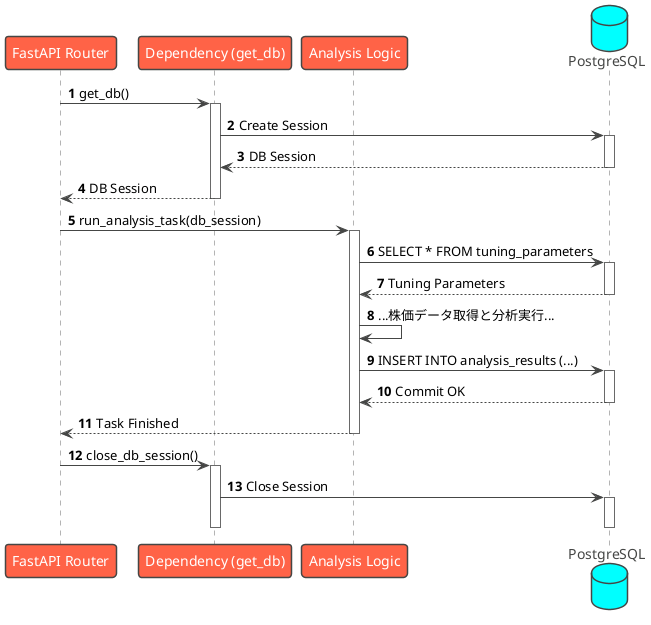
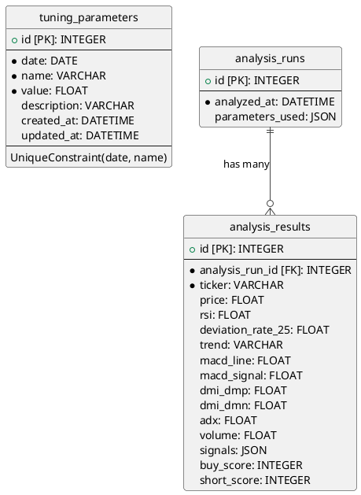

# システムアーキテクチャと設計

このドキュメントは、平日に定時実行されるAI分析、TypeScriptによるフロントエンド、メール通知、AIによる自動パフォーマンスレビューと**動的パラメータチューニング**、そしてフロントエンドでのグラフ描画といった機能を備えたフルスタックアプリケーションのアーキテクチャを概説します。

## 1. 拡張アーキテクチャ (コンポーネント図)

AIによる再評価の結果に基づき、テクニカル指標の計算で用いられる閾値（RSIのレベル、移動平均乖離率など）を動的に変更します。これらの閾値は「チューニングパラメータ」としてデータベースに保存され、分析ロジックおよび再評価ロジックから利用されます。

## 2. フロントエンドアプリケーション

ユーザーインターフェースを提供するため、TypeScriptとReactフレームワークをベースとしたフロントエンドアプリケーションを導入します。バックエンドで定時実行された分析結果の閲覧や、インタラクティブなグラフの表示などを担います。

## 3. シーケンス図

### 3.1. シーケンス: 定時実行される条件付きAI分析と通知

スケジューラが平日の14:30に分析プロセスを自動的に開始します。分析ロジックは、まずデータベースから最新の**チューニングパラメータ（各種テクニカル指標の閾値など）**を読み込み、それを用いてスコアを計算します。スコアが閾値を超え、かつAI分析でリスク無しと判断された銘柄は、ユーザーにメールで通知されます。

### 3.2. シーケンス: AIによる再評価とチューニング

このプロセスはバックエンド内部で完結し、スケジューラによって自動的に実行されます。AIからの提案に基づき、データベース内の**チューニングパラメータ（テクニカル指標の閾値の具体的な数値など）**を更新する処理が含まれます。

### 3.3. シーケンス: 投資判断グラフの生成

バックエンドはグラフ描画用の生データを返却し、フロントエンドがブラウザ上で動的にグラフを描画します。

### 3.4. シーケンス: データベースアクセス詳細

APIがリクエストを受け取ってから、データベースを操作して分析を実行し、結果を保存するまでの一連の流れを以下に示します。

## 4. データベース設計 (ER図)

`tuning_parameters`、`analysis_runs`、`analysis_results`の各テーブル構成を以下に示します。

### テーブルの説明

-   **`tuning_parameters`**:
    *   **役割**: テクニカル分析で使用される各種パラメータ（RSIの期間、移動平均線の閾値など）を格納します。
    *   **特徴**: パラメータは日付ごとにバージョン管理され、分析実行時には最新の日付のパラメータセットが使用されます。これにより、パラメータの動的な調整と履歴管理が可能になります。

-   **`analysis_runs`**:
    *   **役割**: 個々の分析実行のメタデータ（いつ実行されたか、どのパラメータセットが使用されたかなど）を記録します。
    *   **特徴**: 各分析実行は一意のIDを持ち、その実行で使用された`tuning_parameters`のスナップショットが`parameters_used`カラムにJSON形式で保存されます。

-   **`analysis_results`**:
    *   **役割**: 各銘柄の具体的な分析結果（株価、テクニカル指標の値、シグナル、スコアなど）を格納します。
    *   **特徴**: `analysis_run_id`を通じて`analysis_runs`テーブルに紐付けられ、どの分析実行の結果であるかを識別できます。これにより、`parameters_used`の重複を避け、データベースの正規化が実現されています。