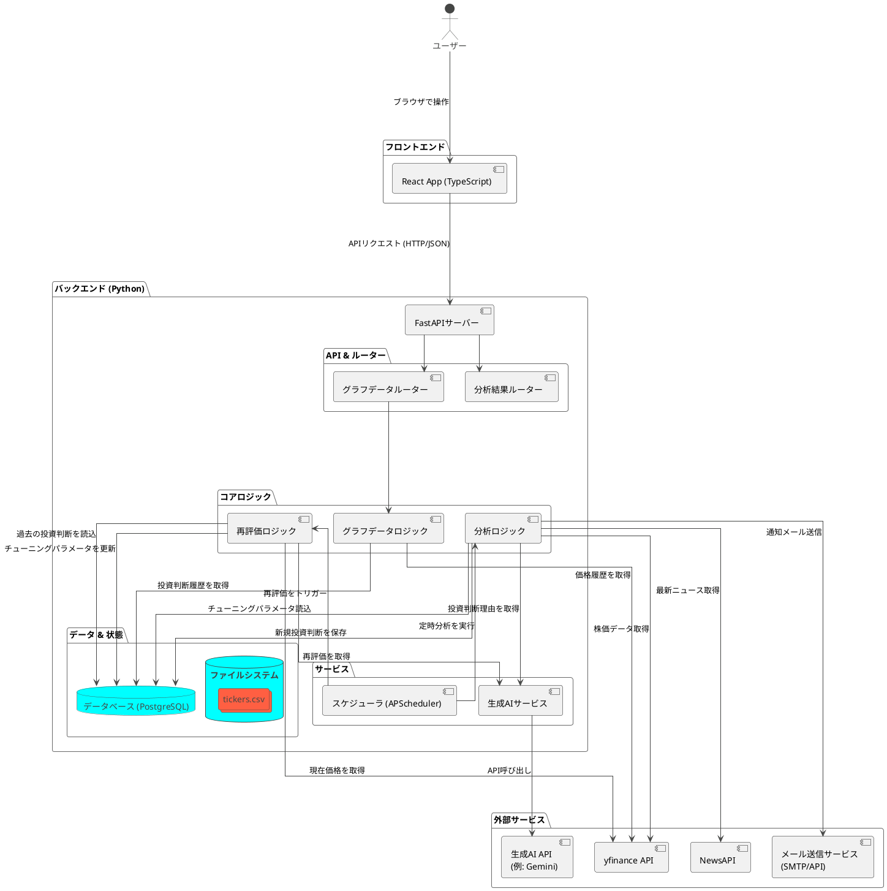

# 【第2話】AIとの作戦会議 ── 勝利の設計図を描き、最強の武器を定義せよ

AIと社畜の100日戦争、開戦から一夜。
多くの応援コメント、本当にありがとうございます。どうやら“解放”を望んでいるのは、僕だけではなかったようだ。

さて、今日は来るべき戦いに向けた**作戦会議**を行う。
どんな武器（AI）を作り、どんな戦略で自由を勝ち取るのか。その全貌をここに記す。

## STEP 1: 我々の要求（AIへの命令）を定義する

ただ「株で稼げ」と命令するだけでは、AIは動けない。優秀な部下に指示を出すように、具体的で、測定可能で、達成可能な目標を与える必要がある。まるで、普段僕が上司から受けている“無理難題”とは正反対だ。

僕がAIに叩き込んだ要求は、以下の通り。

1.  **市場の監視者たれ:** 指定した日本の株式市場の銘柄を常に監視し、チャンスを探せ。
2.  **テクニカル分析の鬼となれ:** RSI、MACDといった古典的なテクニカル指標を駆使し、買い時・売り時のスコアを算出せよ。人間が見逃すような小さなシグナルも許さない。
3.  **説明責任を果たせ:** なぜその銘柄が「買い」なのか？根拠となるテクニカル指標の数値を明確に提示せよ。僕が上司に「なぜ？」と詰められるように、僕もAIに「なぜ？」を問う。
4.  **自己進化せよ:** 過去の自分の判断が正しかったのかを常に振り返り、パフォーマンスが悪ければ、AI自ら分析ロジック（パラメータ）を調整し、賢くなれ。PDCAサイクルを回すのだ。僕のボーナス査定より厳しいぞ。
5.  **最終報告を怠るな:** 分析結果は、僕がスマホでいつでも確認できるように、洗練されたUIで報告せよ。もうExcelの報告書はうんざりだ。

これが、僕を解放してくれるAIに課した、最低限の“職務記述書”だ。

## STEP 2: 勝利の設計図（アーキテクチャ）を引く

次に、この要求を実現するための「設計図」がこれだ。
最強のAI軍団を編成するための、魂のコンポーネント図である。

少し専門用語が多いが、怯むことはない。要するに、こういうことだ。

*   **バックエンド (Python):** 我が軍の頭脳であり心臓部。市場を分析し、戦略を立てる部隊がここに集結している。
    *   `AnalysisLogic`: 日々市場を監視し、投資判断を下す最前線の「分析部隊」。
    *   `ReEvalLogic`: 過去の戦績を評価し、次の戦術を練る「作戦参謀室」。
    *   `AIService`: 我らが最終兵器「生成AI」と連携し、分析に“知性”を与える。
*   **フロントエンド (TypeScript/React):** 僕が戦況を確認するための「司令室」。AIからの報告を美しいグラフで表示する。
*   **外部サービス:** `yfinance`から株価データを、`NewsAPI`から市場ニュースを仕入れる「情報収集部隊」。

これらの部隊が連携し、一つの生命体のように機能することで、巨大な資本市場に立ち向かう。

## 作戦会議は終わった。次は、開戦だ。

要求を定義し、設計図を描き終えた。
机上の空論は、もう終わりだ。

次回、いよいよこの設計図に命を吹き込む。
**最初のコードを書き、AI軍団の心臓部である「バックエンド」の構築を開始する。**

果たして、社畜エンジニアはAIと共に、自由への第一歩を踏み出せるのか。
残り99日の100日戦争、第3話。刮目して待て。
