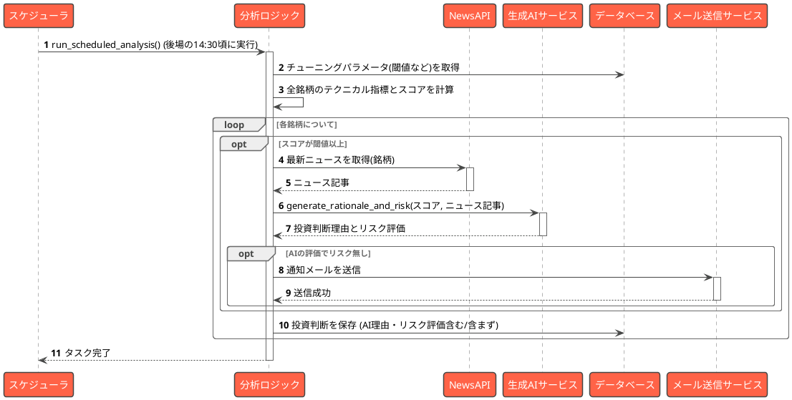
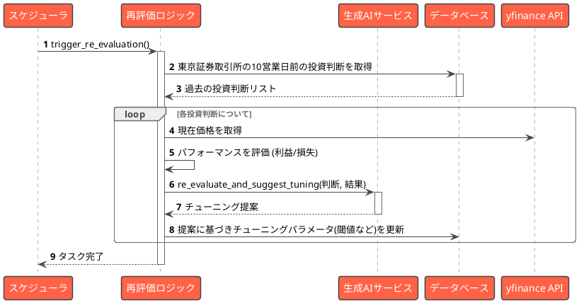
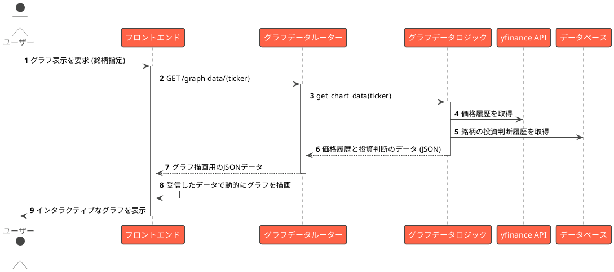

# 【第3話】AIの思考を覗く ── シーケンス図で描く、勝利へのプロセス

前回、我々はAI軍団の全体像を示す「アーキテクチャ図」を完成させた。
しかし、それはあくまで静的な設計図。実際に戦いが始まったとき、各部隊はどのように連携し、情報をやり取りし、意思決定を下すのか？

今回は、その具体的な“思考プロセス”を可視化する「シーケンス図」を作成する。

## STEP 3: AIの思考プロセス（シーケンス図）を引く

これが、我がAI軍団が東京証券取引所の開場時間に、どのように市場を分析し、僕に報告を上げるかの流れを示したシーケンス図だ。
なぜこのプロセス(設計思想)としているのかはまた別のタイミングで解説させていただく予定となる。

この図が示すのは、単なる処理の流れではない。僕の“分身”であるAIが、どのように考え、判断し、行動するかの記録だ。

1.  **定時起動:** スケジューラが、僕が仕事に追われている平日の昼下がり、静かに分析を開始する。
2.  **パラメータ確認:** まず、過去の戦績から学習した最新の「チューニングパラメータ」をデータベースから読み込む。これにより、AIは常に最適な状態で市場に臨む。
3.  **全銘柄分析:** 全ての監視対象銘柄について、テクニカル指標を計算し、スコアを付ける。
4.  **深掘り調査:** スコアが高い有望な銘柄が見つかると、NewsAPIで関連ニュースを収集し、生成AIサービスに「この銘柄は買いか？リスクは？」と意見を求める。
5.  **最終判断と報告:** AIが「リスクなし」と判断すれば、僕のスマホに通知メールが届く。そして、その日の全ての判断は、次の分析に活かすためデータベースに記録される。

これで、AIがどのように動くかの具体的なイメージが固まった。

## AI自身による継続的な学習と成長

市場は常に変化する。一度作ったロジックが未来永劫通用するわけではない。
そこで、我がAI軍団には、自らの判断を振り返り、継続的に学習・成長していくための仕組みを組み込んだ。

### シーケンス: AIによる再評価とチューニング

このシーケンス図は、AIが過去の自分の投資判断をレビューし、パフォーマンスが悪ければパラメータを自動で調整する、自己改善のプロセスを示している。

このプロセスの要点はこうだ。

1.  **定期的レビュー:** スケジューラが定期的に「再評価ロジック」を起動する。
2.  **過去の判断を抽出:** データベースから一定期間が経過した過去の投資判断を引っ張り出す。
3.  **パフォーマンス測定:** 現在の価格を取得し、その判断が利益を生んだのか、それとも損失を出したのかを評価する。
4.  **AIによる考察:** 生成AIサービスに「この判断と結果をどう思う？パラメータをどう変えればもっと良くなる？」と意見を求める。
5.  **パラメータ更新:** AIからの提案に基づき、RSIの閾値や移動平均線の期間といった「チューニングパラメータ」をデータベース上で更新する。

これにより、AIは経験から学び、相場の変化に適応していく。まさに、生きた戦略だ。

## 戦況を可視化するインターフェース

最後に、僕が戦況を一目で把握するためのインターフェースだ。AIの分析結果を、ただの数字の羅列ではなく、直感的に理解できる形で表示する必要がある。

### シーケンス: 投資判断グラフの生成

ユーザー（僕）がフロントエンドで特定の銘柄のグラフ表示を要求した際の、データの流れを示している。

この流れはシンプルだ。

1.  **ユーザーからの要求:** 僕がブラウザで銘柄を指定する。
2.  **データ要求:** フロントエンドがバックエンドに、グラフ描画に必要なデータを要求する。
3.  **データ収集:** バックエンドは、株価の履歴データと、過去にAIが行ったその銘柄に対する投資判断の履歴を、それぞれyfinanceとデータベースから取得する。
4.  **データ提供:** 収集したデータをJSON形式でフロントエンドに渡す。
5.  **グラフ描画:** フロントエンドは受け取ったデータを使って、インタラクティブなグラフをブラウザ上に描画する。価格の動きと共に、AIがどのタイミングで「買い」や「売り」と判断したかが一目瞭然になる。

これで、AIの思考プロセスを可視化する3つのシーケンス図が揃った。
静的なアーキテクチャ図に加え、動的なシーケンス図が手に入ったことで、AI軍団の動きはより明確になった。

## 次回、作戦基地の設営

設計図はできた。次は、このAI軍団が活動するための「作戦基地」を構築する。
次回、**Dockerを使い、誰でも、どこでも、同じ環境を再現できる、不落の作戦基地を構築する。**

AIとの100日戦争、第4話。ここからが本当の戦いだ。